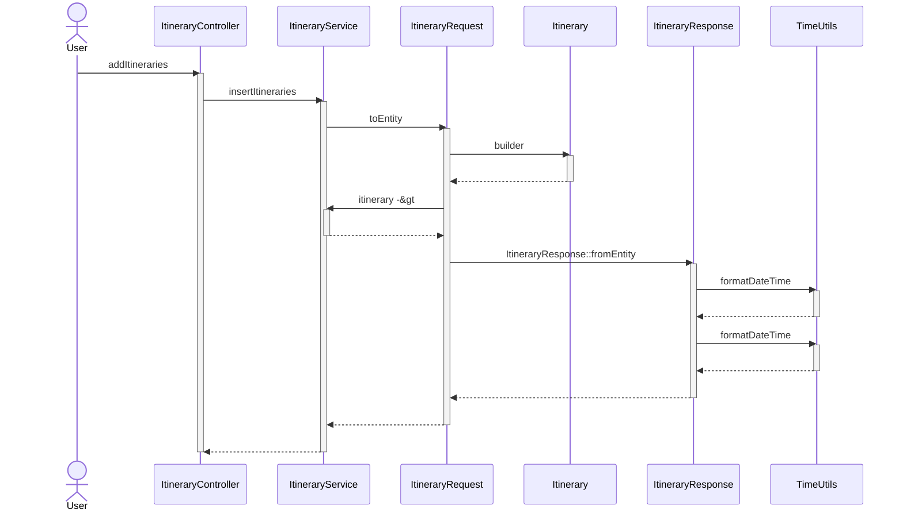
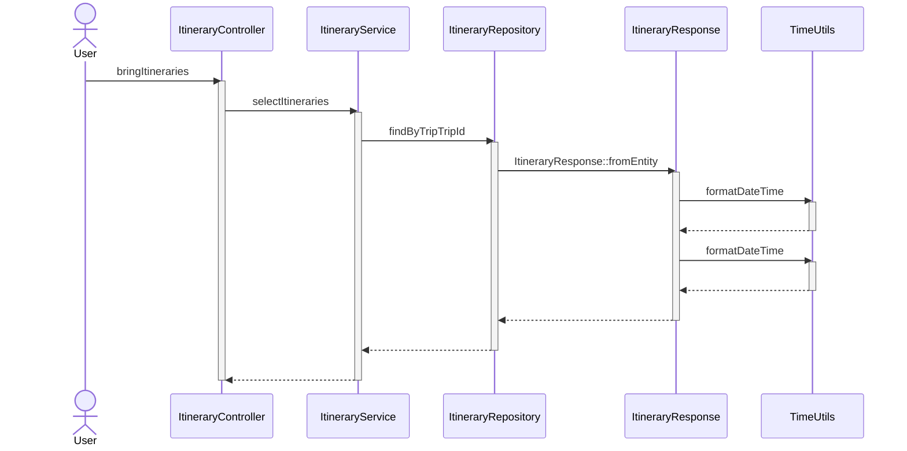
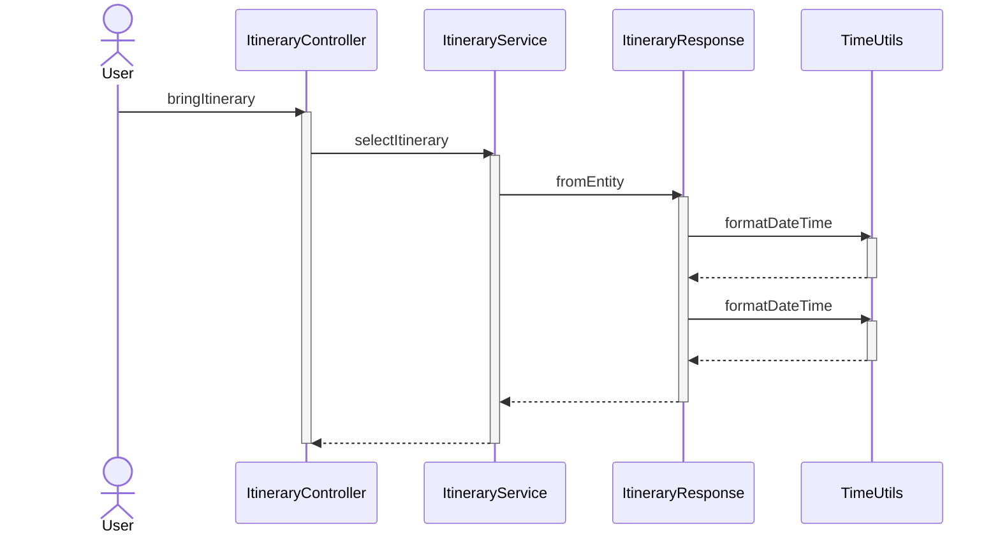
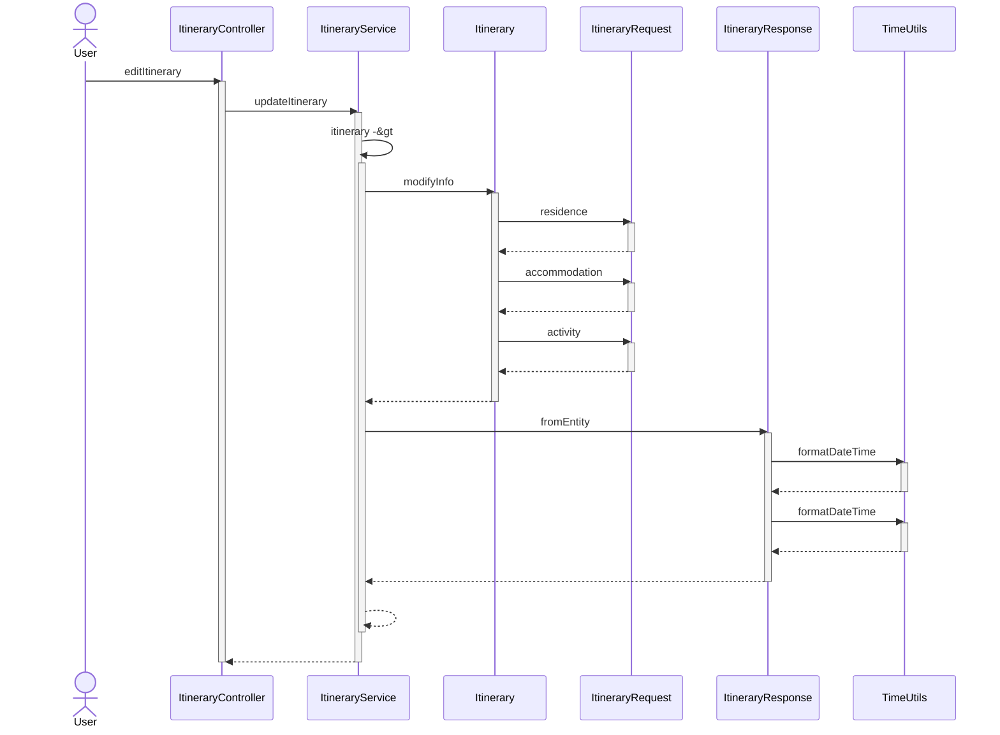
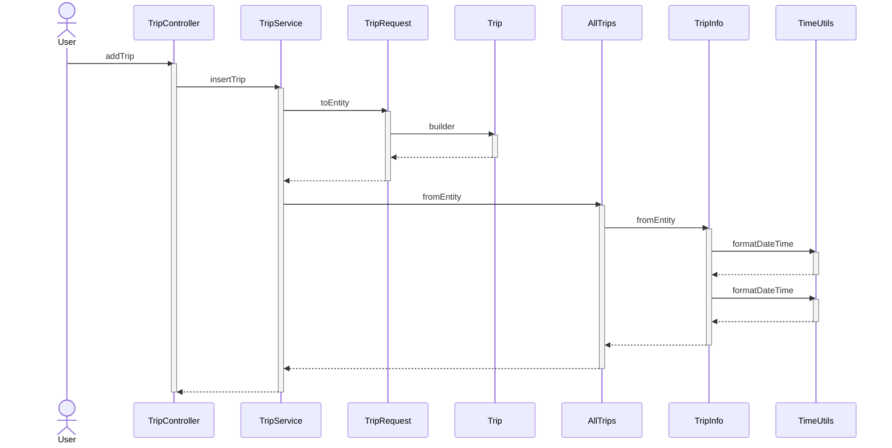
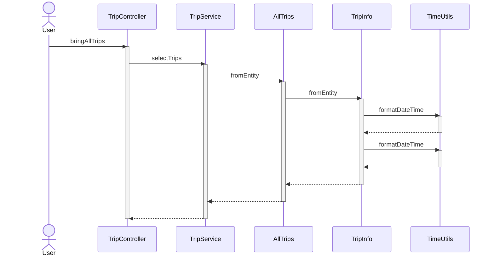
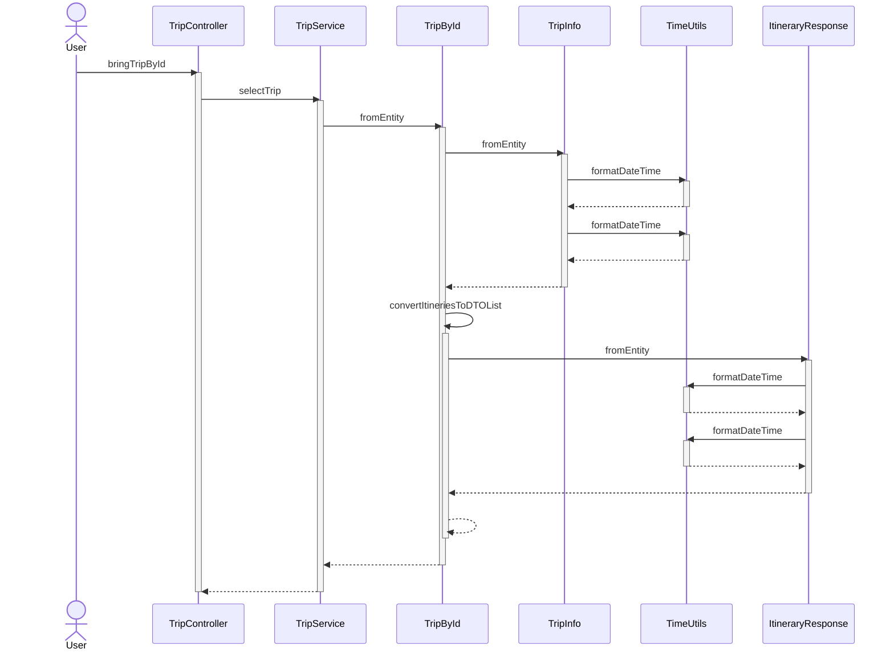
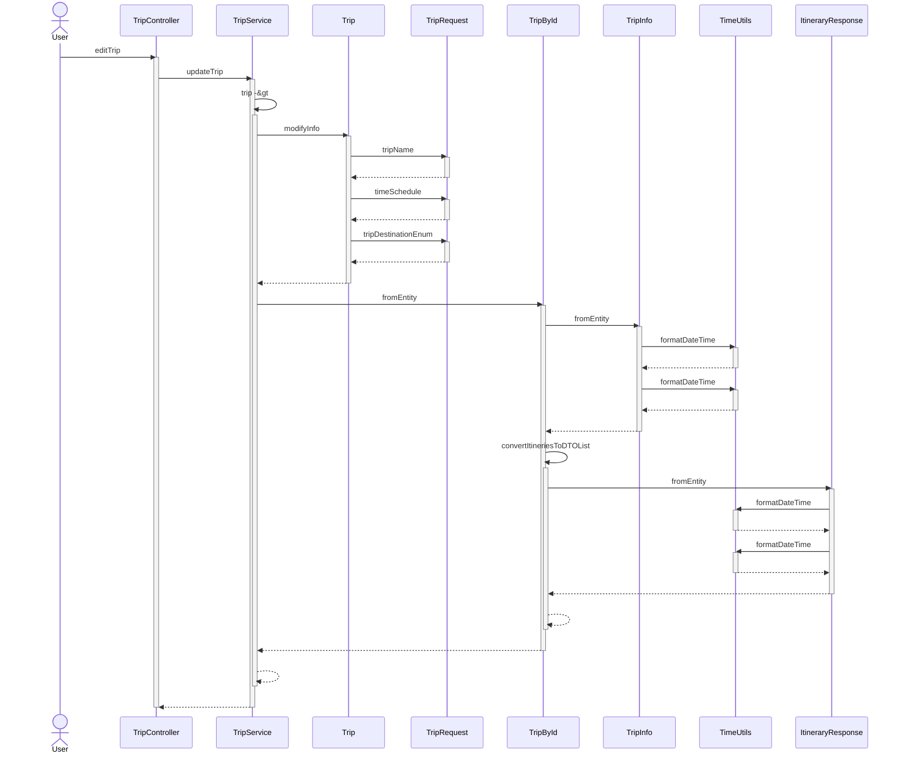

## 개요

■ 프로젝트명

- 여행 여정을 기록과 관리하는 서비스

■ 기간, 참여인원

- 2023.10.23 ~ 2023.10.27
- 옥재욱(팀장), 이유상, 홍용현, 김정훈, 서은

■ 목적

- 협업 및 팀워크 증진을 통하여 동일한 목표 달성 및 성취

■ 핵심 내용

- MVC 패턴을 통한 Spring Boot RESTful API설계, DB설계, DB 트랜잭션
    - 여행의 여정 정보를 기록하고 조회하는 RESTful API개발
    - 개별 여행은 복수의 여정 정보로 구성됨 (여행 : 여정 = 1 : n )
    - 여정 정보는 이동(출발지, 도착지, 출발시각, 도착시각) 과 숙박(체크인, 체크아웃) 등의 유형
    - 여행 정보와 특정 여행 정보의 여정 목록은 데이터베이스에 저장
    

---

## 아키텍처 패턴

MVC

---

## 진행 방식

Agile - Scrum

XP - PairProgramming(Intellij codewithme)

---

## 구현 환경

- Java 17
- Spring Boot
- Docker
- Swagger
- intellij
- gradle

---

## 브랜치 전략

Git-flow 사용

---

## 기능

### 여행 등록기능

여행 일정을 기록할 수 있다.

### 특정 여행의 여정등록 기능

하나의 여행에 여러 개의 여정 정보를 기록할 수 있다.

### 여행 조회 기능

등록된 여행 전체 리스트를 조회할 수 있다.
등록된 여행 리스트 중 여행 ID를 parameter로 받아서 해당 여행에 대한 정보와 여정 정보를 자세히 조회할 수 있다.

### 여행 정보 수정 기능

여행 정보를 수정할 수 있다.

### 여정정보 수정기능

여정정보를 수정할 수 있다.

### 예외 처리

여행 등록 시 실패하면 오류메시지를 출력하여 예외 발생
여행 조회, 수정 시 여행정보가 없으면 오류메시지를 출력하여 예외발생

---

## API

Swagger 참고

### 여행(Trip)

| 기능 | HTTP Method | EndPoint | 설명 |
| --- | --- | --- | --- |
| 여행 조회 다건 | GET | http://localhost:8080/trip | 모든 여행 정보를 조회 |
| 여행 조회 단건 | GET | http://localhost:8080/trip/{id} | 특정 여행 정보를 조회 |
| 여행 등록 | POST | http://localhost:8080/trip | 여행정보 등록 |
| 여행 수정 | PATCH | http://localhost:8080/trip/{id} | 여행정보 수정 |

### 여정(Itinerary)

| 기능 | HTTP Method | EndPoint | 설명 |
| --- | --- | --- | --- |
| 여행 조회 다건 | GET | http://localhost:8080/itinerary/trip/{id} | 모든 여행 정보를 조회 |
| 여정 조회 단건 | GET | http://localhost:8080/itinerary/{id} | 특정 여행정보를 조회 |
| 여정 등록 | POST | http://localhost:8080/itinerary/{id} | 여행정보 등록 |
| 여정 수정 | PATCH | http://localhost:8080/itinerary/{id} | 여행정보 수정 |

---

## ERD

### DB Diagram


### Persistence View


---

## 흐름도

`addItineraries`




---

`bringItineraries`




---

`bringItinerary`




---

`editItinerary`




---

### Trip

`addTrip`




---

`bringAllTrips`




---

`bringTripById`




---

`editTrip`




---

## 패키지 구조

```bash
├── build.gradle
├── database
│   ├── Dockerfile
│   └── init.sql
├── docker-compose.yml
├── gradle
│   └── wrapper
│       ├── gradle-wrapper.jar
│       └── gradle-wrapper.properties
├── gradlew
├── gradlew.bat
├── qodana.yaml
├── settings.gradle
└── src
    ├── main
    │   ├── java
    │   │   └── com
    │   │       └── example
    │   │           └── kdt_y_be_toy_project2
    │   │               ├── KdtYBeToyProject2Application.java
    │   │               ├── domain
    │   │               │   ├── itinerary
    │   │               │   │   ├── controller
    │   │               │   │   │   ├── ItineraryController.java
    │   │               │   │   │   └── ItineraryControllerAdvice.java
    │   │               │   │   ├── dto
    │   │               │   │   │   ├── ItineraryRequest.java
    │   │               │   │   │   ├── ItineraryResponse.java
    │   │               │   │   │   └── sub
    │   │               │   │   │       ├── AccommodationDTO.java
    │   │               │   │   │       ├── ActivityDTO.java
    │   │               │   │   │       └── ResidenceDTO.java
    │   │               │   │   ├── entity
    │   │               │   │   │   ├── Accommodation.java
    │   │               │   │   │   ├── Activity.java
    │   │               │   │   │   ├── Itinerary.java
    │   │               │   │   │   ├── Residence.java
    │   │               │   │   │   └── TransportEnum.java
    │   │               │   │   ├── error
    │   │               │   │   │   ├── ItineraryNotInsertedException.java
    │   │               │   │   │   ├── ItineraryNotLoadedException.java
    │   │               │   │   │   └── ItineraryNotUpdatedException.java
    │   │               │   │   ├── repository
    │   │               │   │   │   └── ItineraryRepository.java
    │   │               │   │   └── service
    │   │               │   │       └── ItineraryService.java
    │   │               │   └── trip
    │   │               │       ├── controller
    │   │               │       │   ├── TripController.java
    │   │               │       │   └── TripControllerAdvice.java
    │   │               │       ├── dto
    │   │               │       │   ├── TripRequest.java
    │   │               │       │   └── TripResponse.java
    │   │               │       ├── entity
    │   │               │       │   ├── Trip.java
    │   │               │       │   └── TripDestinationEnum.java
    │   │               │       ├── error
    │   │               │       │   ├── NotValidTripNameException.java
    │   │               │       │   ├── TripNotInsertedException.java
    │   │               │       │   ├── TripNotLoadedException.java
    │   │               │       │   ├── TripNotUpdatedException.java
    │   │               │       │   ├── TripRequestTimeoutException.java
    │   │               │       │   └── TripServiceUnavailable.java
    │   │               │       ├── repository
    │   │               │       │   └── TripRepository.java
    │   │               │       └── service
    │   │               │           └── TripService.java
    │   │               └── global
    │   │                   ├── dto
    │   │                   │   └── TimeScheduleDTO.java
    │   │                   ├── entity
    │   │                   │   ├── BaseTimeEntity.java
    │   │                   │   └── TimeSchedule.java
    │   │                   ├── exception
    │   │                   │   ├── ErrorMessage.java
    │   │                   │   └── GlobalException.java
    │   │                   └── util
    │   │                       └── TimeUtils.java
    │   └── resources
    │       ├── application-core.yml
    │       ├── application-dev.yml
    │       └── application.yml
    └── test
        ├── Http
        │   ├── Itinerary.GET.ALL.http
        │   ├── Itinerary.GET.ONE.http
        │   ├── Itinerary.PATCH.ONE.http
        │   ├── Itinerary.POST.MULTIPLE.http
        │   ├── Itinerary.POST.SampleTest-2.http
        │   ├── Trip.GET.ALL.http
        │   ├── Trip.GET.ONE.http
        │   ├── Trip.PATCH.ONE.http
        │   └── Trip.POST.ONE.http
        └── java
            └── com
                └── example
                    └── kdt_y_be_toy_project2
                        └── KdtYBeToyProject2ApplicationTests.java
```
